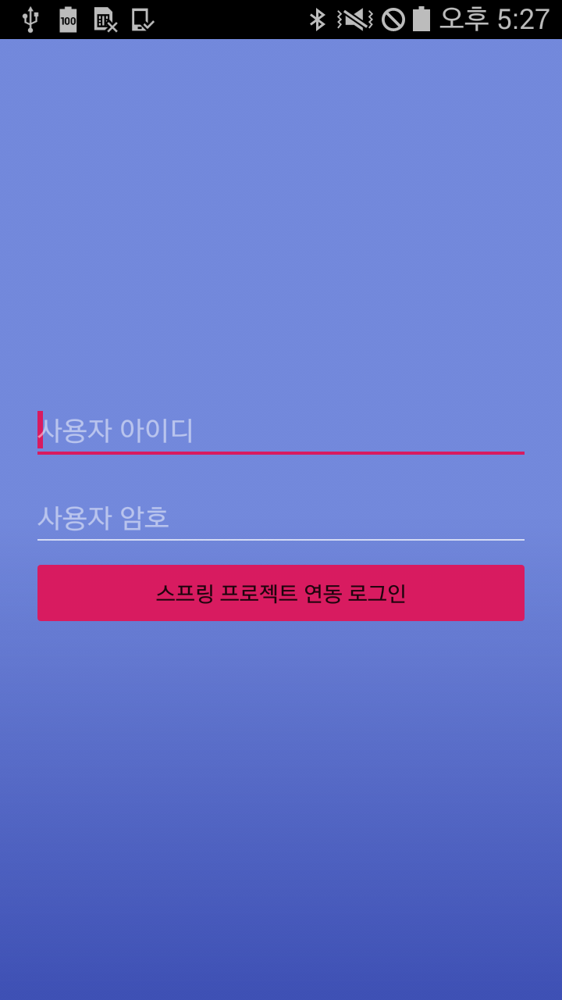
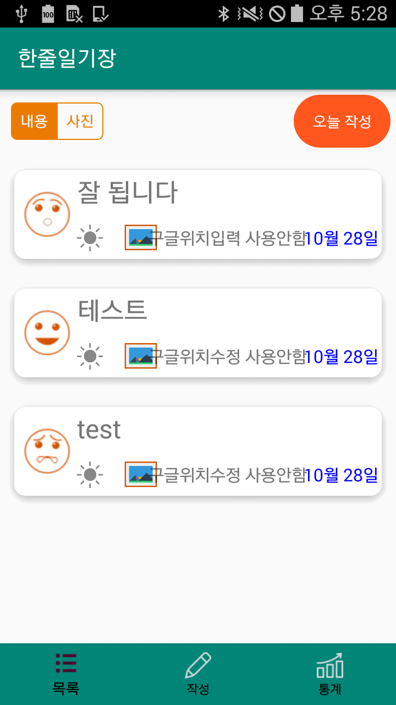
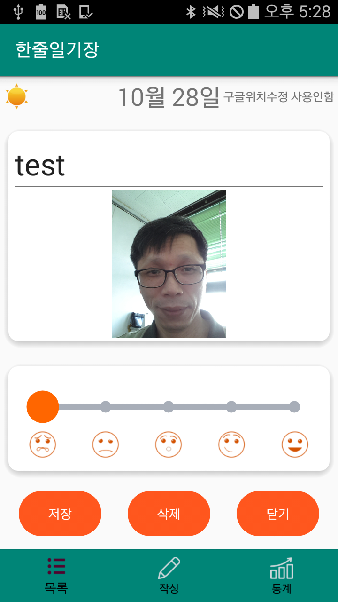

#### 한줄일기장 참조 소스 및 기타정보
- https://github.com/mike-jung/DoItAndroidRev8/tree/master/part3/SingleDiary4
- 테스트기기를 API24이상(안드로이드7.0 누가버전2016년)으로 변경 후 테스트예정.
- 깃 master 브랜치링크: [UI강의 소스로 사용](https://github.com/miniplugin/SingleDiary/tree/master)
- 깃 dev 브랜치링크: [개발강의 소스로 사용](https://github.com/miniplugin/SingleDiary/tree/dev)
- 작업결과는 제일 하단에 캡쳐이미지 참조해주세요

#### 미처리 사항
- 검색어 .load(new File(filePath)) : 이미지 가로로 자동 변경 되는 문제가 리스트 클릭시 상세보기 에서 발생됨.
- 기존 앨범에서 선택하기는 잘 작동됨.
- GPS 위치정보로 영문주소와 해당위치의 기상청 날씨정보를 불러오는 부분은 강의에서 생략함.

#### 20211027(수): Fragment3.java 와 글CRUD 마무리작업
- Fragment1 에서 목록 클릭시 Fragment2 글수정화면으로 이동처리(수정/삭제기능)OK.
- Fragment3 통계화면과 DB연동시키기OK.

#### 20211026(화): Fragment2.java
- 리스트화면에 보여주기위해서 입력화면에 저장하는 코딩.

#### 20211025(월): Fragment1.java
- 지금까지 작업한 내역은 UI강의 소스로 사용.(깃의 master 브랜치)
- 깃에서 새 dev 브랜치 생성: 개발강의 소스로 사용.
- 앱을 SQLite 데이터베이스와 연동하기.
- NoteDatabase SQLite 테이블 만들기.
- MainActivity 에 openDatabase(); 로 DatabaseHelper 클래스객체 생성하면서 DB파일도생성
- Fragment1 의 리사이클러뷰에 데이터어댑터 바인딩함.
- 작업중 unknown pattern character 'Y' android 에러 Logcat 으로 확인됨.
- 원인은 SimpleDateFormat 의 패턴에 대문자 Y를 사용해서 임. 소문자 y로 변경 후 OK.

#### 20211024(일) : 거의 1년만에 이어서 작업합니다.^^
- 사진찍기 대화상자에서 앨범에서 사진선택 앨범에서 가져오기 처리(아래)
- 갤럭시 앨범에서 사진 회전되어서 불러오는 문제는 Glide4.9.0 모듈로 처리
- 카메라에서 사진찍어서 즉시 저장하는 방식은 작동 않됨. 테스트 기기가 API19 버전이라서 아래이유발생.
- build.gradle의 targetSdkVersion을 24미만으로 설정해야 아래경로로 파일이 저장됨
- 테스트기기를 API24이상(안드로이드7.0 누가버전2016년)으로 변경 후 테스트예정.
- 안드로이드 정책임. 참조: https://darksilber.tistory.com/325

#### 20201015(목)
- 챠트모듈추가: com.github.PhilJay:MPAndroidChart:v3.1.0-alpha
- 프레그먼트3: 통계페이지
- 사진 찍기 앱 처리OK. 앨범에서 사진선택 미처리.

#### 20201014(수)
- 자동인증모듈추가: com.github.pedroSG94:AutoPermissions:1.0.3 (카메라모듈을 작업앱에서 사용시 자동인증되어서 사용가능)
- 슬라이드모듈추가: com.github.channguyen:rsv:1.0.1 (글쓰기 폼에서 레인지 슬라이드객체)
- 글작성 액티비티(화면): Fragment2.java - fragment2.xml

#### 20201012(월)
- 스위치버튼모듈추가: lib.kingja.switchbutton:switchbutton:1.1.8 (목록페이지에서사용)
- 머티어리얼모듈추가: 디자인보가에서 AppBarLayout 모듈다운로드로 추가. 이것만 자동추가, 이후 수동추가.
- 데이터(SQLite|더미) - 어댑터(어댑터관리자:DAO역할) - 리스트(RecylerViewer)
- 반자동으로 만들어진 리사이클러뷰어 프래그먼트를
- 단위: dp(덴서티픽셀,density pixel,밀도픽셀)-화면의 크기에 따라서 자동으로 확대/축소가 되는 단위(반응형)
- 단위: sp(스케일드픽셀,scaled pixel,확대픽셀)-스마트폰 지정하는 글꼴크기로 설정가능한 단위(글자크기 전용)
- Fragment1.java -인플레이트(올리다)> fragment1.xml -> NoteAdapter.java -인플레이트(올리다)> note_item.xml
- RecyclerView 라는 리스트와 DAO역할을 하는 어댑터 이름 변경
- MyItemRecyclerViewAdapter.java(더미데이터) -> NoteAdapter.java(SQLite데이터)
- 반자동 코딩 이지만, 개발자 손이 가는 반자동 입니다.
- Fragment3.java 만들기: 스크롤 프레그먼트(Scroll), 챠트 출력화면.
- Fragment2.java 만들기: 빈 프레그먼트(Blank), 글쓰기 작성화면.
- Fragment1.java 만들기: 목록List(리스트-리사이클러뷰 기본 액티비티 만들기)-더미데이터 자동 생성됩니다.
- 하단 탭메뉴 완성. 이제 프레그먼트(조각 뷰)를 불러오기.
- 프레그먼트 Fragment1(데이터리스트), Fragment2(글쓰기폼), Fragment3(통계출력_상하스크롤)
- 액티비티 관리 : 안드로이드 시스템 관리자에서...=> AndroidManifest.xml
- 프레그먼트 관리 : 액티비티 관리자에서... => 해당Activity.java에서 관리
- 하단 탭메뉴: Bottom_Navigation...컨테이너 사용.(목록/작성/통계)
- 스플래시 : 페이지 로딩 화면에 주로 사용합니다.
- 안드로이드 스튜디오 더하기(+) 수업
- 매일 이력서 제출처 발굴시간

#### 20201008(목)
- 메인 액티비티 제작 순서: 가져다 사용할 블럭 먼저 제작 후 조립해서 만듭니다.
- 조립은 MainActivity.java 클래스에서 조립합니다.
- 스프링-이클립스 : pom.xml(메이븐): xml 태그 방식
- 안드로이드-인텔리J : bulid.gradle(그레들): 스크립트 방식
- 위 디펜던시(의존성추가) 실습: 팔레트>container>AppBarLayout 를 다운로드시 자동으로 위 그레들에 추가됨.
- MainActivity클래스 바탕 구성요소-인클루드include: Fragment1,2,3 클래스
- 메인액티비티에서 탭메뉴액션: 탭1 - 프레그먼트1, 탭2 - F2, 탭3 - F3
- 프레그먼트: 부분들,조각들(F1, F2, F3 화면조각들)
- 하단 탭메뉴를 이용해서 메인액티비티 본문부분에 Fragment조각화면이 위치
- 실행순서1. LoginActivity.java클래스 onCreate()메서드 실행
- 실행순서2. onCreate메서드 안에 있는 setContentView(activity_login.xml)메서드 실행되면서 화면에 뿌려줌(렌더링됨).
- Gradle(인텔리J기반안드로이드스튜디오) =동급= Maven(이클립스스프링프로젝트)
- 디지털컨버전스 15과목, 16과목 관련 안드로이드4.0.1 앱 더하기 작업.
- 1. 스플레시 액티비티 만들기 OK.
- 2. 로그인 액티비티 만들기 예정.
- 3. 메인 액티비티 만들기 예정.

#### 20201007(수) :
- 안드로이드4.0.1 앱 더하기 작업.
- 스플레시 액티비티 만들기 OK.

- 작업결과(아래)

